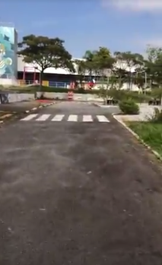

#  Video Processing based Road/Lane Segmentation  

## Project Description

This repository is about my Final Project of my undergraduate course "Processamento Digital de Imagens" or Digital Image Processing, on UFABC, taught in the first semester of 2020. The project aims to try out different approaches for lane boundaries detection, road segmentation and also a vision based solution to steering angle feedback controller. The approaches were firstly sketched into one sample image of a road scene, and then tested on the full video.

## Source Video

The source video chosen for this project was about a "small-city" created to teach kids about traffic signs and norms. Most of the tests were made on a sample image of the video, as shown below:

## Objectives

The project goals were:
- Detect road lanes on videos
- Apply road segmentation on videos
- Get the road direction to achieve steering feedback input

## Techniques applied

For this project, it was applied the following techniques:

- Image thresholding + HoughLines for lane detection
- Color segmentation + Image Centroid for road segmentation
- K-Means for road segmentation 
- Deep Learning Model for road segmentation trained on KITTI dataset (Still not added on the repo)

## Results (Under Construction)

### Canny edges lane detection

### K-Means segmentation (slow!)

### Color Segmentation

### Future Work

-  Improve the segmentation robustness
- Compare with CNN Segmentation 
### License

This project is released under the MIT License. Please review the [License file](LICENSE) for more details.
